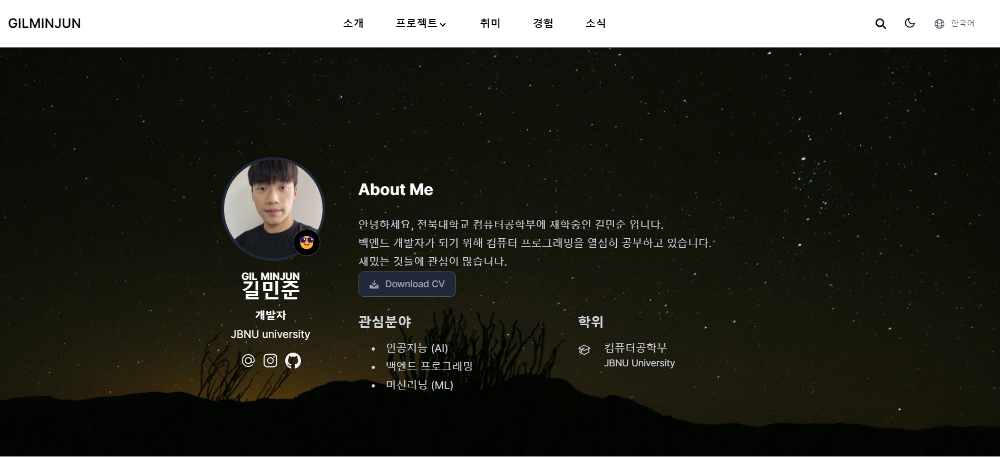

# [Hugo Academic CV Theme](https://github.com/HugoBlox/theme-academic-cv)

휴고의 **Academic CV Template** 을 활용하여 포토폴리오 사이트를 제작하였습니다.

  

포토폴리오에는 프로젝트, 관심사, 정보 등이 들어있습니다.

## 정보

사진, 소개, 관심사, 목표가 있습니다.

### 프로젝트

프로젝트 중 세 개의 항목을 배치했습니다.

## Demo image credits

- [Unsplash](https://unsplash.com)

unsplash 무료 이미지를 다수 활용하였습니다.
