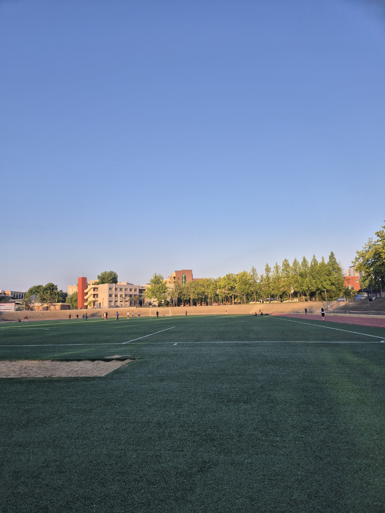

저는 다양한 운동을 좋아합니다. 

사실 거의 대부분의 운동을 좋아합니다.

그 중에서도 꾸준히 하는 운동이 있습니다.

**책상에 오래 앉아있기 위해서...**

## 사진

전북대학교의 대운동장 사진입니다.

## 소개

런닝을 꾸준히 한 지는 2년 정도 된 것 같습니다.

시작은 군대의 체력단련실이었습니다.

당시에는 몸의 군살도 없애고, 체력도 기르기 위해서 관심을 가졌습니다.

처음에는 런닝의 피로가 너무 힘들고, 운동 효과를 느끼기 보다는 근육통에 시달렸습니다.

하지만 일주일도 되기 전에 런닝의 효과를 몸소 느끼게 되었습니다.

그때부터 저는 일주일에 한 번씩은 런닝을 하게 되었습니다.
